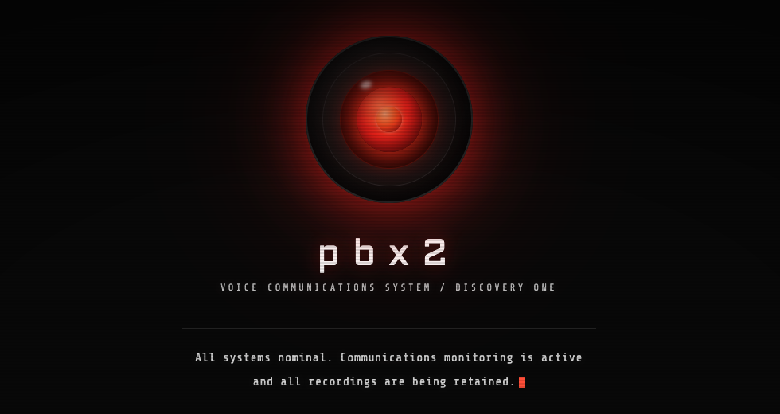

# DVRTC - Damn Vulnerable Real-Time Communications

[](https://polyformproject.org/licenses/noncommercial/1.0.0/)

DVRTC is an intentionally vulnerable VoIP/WebRTC lab for security training and research.

## Warning

Deploy DVRTC only on isolated, dedicated systems. Do not run it alongside production workloads or sensitive data. Expect weak credentials, exposed services, and vulnerable behavior by design.

## What Is DVRTC?

DVRTC packages a vulnerable RTC deployment together with scenario documentation, exercises, and verification tooling. Users can run the stack, explore attack paths, and confirm behavior against the current repository state. The bundled exercises use the included test toolkit, but any external VoIP/RTC security tool works against the stack too (see [awesome-rtc-hacking](https://github.com/EnableSecurity/awesome-rtc-hacking#open-source-tools) for ideas).

## Current Scope

The repository currently ships two scenarios:

- `pbx1` is the Kamailio/Asterisk/rtpengine scenario.
- `pbx2` is the OpenSIPS/FreeSWITCH/rtpproxy scenario.

Run only one scenario at a time on a given host. Both scenarios rely on host networking for the core RTC services and reuse overlapping ports, so `pbx1` and `pbx2` cannot run concurrently on the same machine.

Scenario summaries:

### `pbx1`

- Stack: Kamailio, Asterisk, rtpengine, coturn, Nginx, and MySQL.
- Focus: SIP signaling, digest auth leakage, weak credentials, RTP/media abuse, TURN relay abuse, and SIP-adjacent SQL/XSS paths.
- Exercises: 7 step-by-step exercises and 12 identified attack paths. Additional vulnerable behaviors are covered in the scenario docs and regression checks.
- Start: `./scripts/compose.sh --scenario pbx1 up -d`

### `pbx2`

- Stack: OpenSIPS, FreeSWITCH, rtpproxy, and the shared web/helper surfaces.
- Focus: SIP signaling, plaintext traffic analysis, weak credentials, digest leak, RTP/media abuse, recorded packet captures, and SIP flood behavior.
- Exercises: 8 step-by-step `pbx2` exercise stubs cover the current attack paths. The bundled smoke/regression suites remain the source of truth for reproducibility. The MySQL-backed SQLi/XSS surface from `pbx1` is intentionally not part of `pbx2`.
- Start: `./scripts/compose.sh --scenario pbx2 up -d`

Both scenarios use pinned runtime images from the compose manifest set in `compose/base.yml`, `compose/pbx1.yml`, `compose/pbx2.yml`, and `VERSION`. For local rebuilds, see [docs/development.md](docs/development.md).

Live deployments are currently available:

- **pbx1** at `pbx1.dvrtc.net` — see the [pbx1 Scenario Overview](docs/pbx1/overview.md) for public endpoints and usage notes.
- **pbx2** at `pbx2.dvrtc.net` — see the [pbx2 Scenario Overview](docs/pbx2/overview.md) for public endpoints and usage notes.

Verify reachability before relying on either deployment.

Start here for scenario-specific details:

- [pbx1 Scenario Overview](docs/pbx1/overview.md)
- [pbx1 Exercise Index](docs/pbx1/exercises/README.md)
- [pbx1 Architecture](docs/pbx1/architecture.md)
- [pbx2 Scenario Overview](docs/pbx2/overview.md)
- [pbx2 Exercise Index](docs/pbx2/exercises/README.md)
- [pbx2 Architecture](docs/pbx2/architecture.md)

<p align="center">
  <a href="https://pbx1.dvrtc.net/"></a>
  <a href="https://pbx2.dvrtc.net/"></a>
</p>

## Quick Start

### Prerequisites

- Docker 20.10 or newer
- Docker Compose plugin with `docker compose` support
- Linux host with host networking support
- At least 4 CPU cores, 8 GB RAM, and 10 GB disk space recommended for the full stack

If you are on macOS, use the Colima workflow in [docs/colima-setup.md](docs/colima-setup.md). Direct Docker Desktop deployment on macOS or Windows is not the supported path for this stack.

### Initial Setup

```bash
./scripts/setup_networking.sh
./scripts/generate_passwords.sh
./scripts/init-selfsigned.sh
./scripts/validate_env.sh
./scripts/compose.sh --scenario pbx1 up -d
```

Once the stack is up, you're ready to jump into the hands-on exercises in the [pbx1 Exercise Index](docs/pbx1/exercises/README.md).

To start the `pbx2` scenario instead, use:

```bash
./scripts/compose.sh --scenario pbx2 up -d
```

Equivalent raw Compose commands are:

```bash
docker compose --project-directory . -p dvrtc-pbx1 -f compose/base.yml -f compose/pbx1.yml up -d
docker compose --project-directory . -p dvrtc-pbx2 -f compose/base.yml -f compose/pbx2.yml up -d
```

Plain `docker compose up -d` is not a valid scenario selector here. The base file at `compose/base.yml` only carries shared runner definitions, so it exits with `no service selected` unless you add a scenario file or use the wrapper.
Do not start both raw scenario commands at the same time on the same host. `pbx1` and `pbx2` overlap on host-networked SIP, web, TURN, and RTP ports. The wrapper script handles this by stopping the other scenario before startup.

If you want publicly trusted certificates instead of self-signed lab certs, set `DOMAIN` and `EMAIL` in `.env` and use `./scripts/init-letsencrypt.sh` instead.

### Verify The Stack

```bash
./scripts/compose.sh --scenario pbx1 ps
```

Manual host-shell check (requires `.env` sourced for the IP variable):

```bash
. ./.env
curl "http://${PUBLIC_IPV4}/"
```

Wrapper scripts for the bundled test suites:

```bash
./scripts/testing-smoke.sh
./scripts/testing-run-all.sh
./scripts/attacker-run-all.sh
./scripts/testing-smoke.sh --scenario pbx2
./scripts/testing-run-all.sh --scenario pbx2
./scripts/attacker-run-all.sh --scenario pbx2
```

Use `PUBLIC_IPV4` from `.env` for browser and host-side access checks. On Colima or another Linux VM workflow, that VM address is the canonical DVRTC endpoint even if the platform also forwards ports onto the macOS host. The `testing` runner targets `127.0.0.1` inside the Linux host network namespace. See [TESTING.md](TESTING.md) for the full command reference. Use [`./scripts/compose.sh`](scripts/compose.sh) for normal runtime operations. [`./scripts/dev-compose.sh`](scripts/dev-compose.sh) is the maintainer rebuild wrapper.

For a quick manual SIP check, register extension `1000` with password `1500` in a SIP client and call `1200` for the echo service.

## Key Documentation

- [pbx1 Scenario Overview](docs/pbx1/overview.md) - credentials, ports, component roles, and scenario entry points
- [pbx1 Exercise Index](docs/pbx1/exercises/README.md) - current hands-on exercise set
- [pbx2 Scenario Overview](docs/pbx2/overview.md) - current `pbx2` stack, attack paths, and exposed surfaces
- [pbx2 Exercise Index](docs/pbx2/exercises/README.md) - current `pbx2` exercise stubs for all known scenario paths
- [Troubleshooting](docs/troubleshooting.md) - current repo-specific failure modes and diagnostics
- [Development and Local Builds](docs/development.md) - maintainer rebuild workflow and platform constraints
- [Contributing](CONTRIBUTING.md) - contribution expectations for this project

## Inspiration

DVRTC was inspired by vulnerable training platforms like [DVWA](https://github.com/digininja/DVWA), [WebGoat](https://owasp.org/www-project-webgoat/), and [WrongSecrets](https://github.com/OWASP/wrongsecrets).

## License

DVRTC is licensed under the [PolyForm Noncommercial License 1.0.0](LICENSE).

## Project Links

- Website: [Enable Security](https://www.enablesecurity.com/)
- Newsletter: [RTCSec Newsletter (monthly)](https://www.enablesecurity.com/newsletter/)
