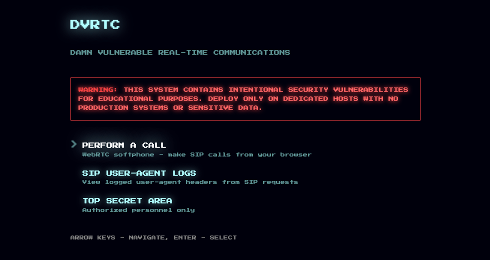

# DVRTC - Damn Vulnerable Real-Time Communications

[](https://polyformproject.org/licenses/noncommercial/1.0.0/)

DVRTC is an intentionally vulnerable VoIP/WebRTC lab for security training and research.

## Warning

Deploy DVRTC only on isolated, dedicated systems. Do not run it alongside production workloads or sensitive data. Expect weak credentials, exposed services, and vulnerable behavior by design.

## What Is DVRTC?

DVRTC packages a vulnerable RTC deployment together with scenario documentation, exercises, and verification tooling. Users can run the stack, explore attack paths, and confirm behavior against the current repository state. The bundled exercises use the included test toolkit, but any external VoIP/RTC security tool works against the stack too (see [awesome-rtc-hacking](https://github.com/EnableSecurity/awesome-rtc-hacking#open-source-tools) for ideas).

## Current Scope

The current repository ships one active scenario: `pbx1`.

- Stack: Kamailio, Asterisk, rtpengine, coturn, Nginx, and MySQL.
- Focus: SIP signaling, digest auth leakage, weak credentials, RTP/media abuse, TURN relay abuse, and SIP-adjacent SQL/XSS paths.
- 7 exercises and 12 identified attack paths. Additional vulnerability behaviors are covered in the scenario reference docs and automated regression checks.
- Runs on published images out of the box. The image versions are pinned in `docker-compose.yml` and `VERSION`. For local rebuilds, see [docs/development.md](docs/development.md).

A live deployment of the `pbx1` scenario is currently available at `pbx1.dvrtc.net`. Verify it is reachable before relying on it. See the [pbx1 Scenario Overview](docs/pbx1/overview.md) for the public endpoints and usage notes.



Start here for scenario-specific details:

- [pbx1 Scenario Overview](docs/pbx1/overview.md)
- [pbx1 Exercise Index](docs/pbx1/exercises/README.md)
- [pbx1 Architecture](docs/pbx1/architecture.md)

## Quick Start

### Prerequisites

- Docker 20.10 or newer
- Docker Compose plugin with `docker compose` support
- Linux host with host networking support
- At least 4 CPU cores, 8 GB RAM, and 10 GB disk space recommended for the full stack

If you are on macOS, use the Colima workflow in [docs/colima-setup.md](docs/colima-setup.md). Direct Docker Desktop deployment on macOS or Windows is not the supported path for this stack.

### Initial Setup

```bash
./scripts/setup_networking.sh
./scripts/generate_passwords.sh
./scripts/init-selfsigned.sh
./scripts/validate_env.sh
docker compose up -d
```

If you want publicly trusted certificates instead of self-signed lab certs, set `DOMAIN` and `EMAIL` in `.env` and use `./scripts/init-letsencrypt.sh` instead.

### Verify The Stack

```bash
docker compose ps
```

Manual host-shell check (requires `.env` sourced for the IP variable):

```bash
. ./.env
curl "http://${PUBLIC_IPV4}/"
```

Wrapper scripts for the bundled test suites:

```bash
./scripts/testing-smoke.sh
./scripts/testing-run-all.sh
./scripts/attacker-run-all.sh
```

Use `PUBLIC_IPV4` from `.env` for browser and host-side access checks. The `testing` runner targets `127.0.0.1`, even when Docker is running inside Colima or another Linux VM. See [TESTING.md](TESTING.md) for the full command reference.

For a quick manual SIP check, register extension `1000` with password `1500` in a SIP client and call `1200` for the echo service.

## Key Documentation

- [pbx1 Scenario Overview](docs/pbx1/overview.md) - credentials, ports, component roles, and scenario entry points
- [pbx1 Exercise Index](docs/pbx1/exercises/README.md) - current hands-on exercise set
- [Troubleshooting](docs/troubleshooting.md) - current repo-specific failure modes and diagnostics
- [Development and Local Builds](docs/development.md) - maintainer rebuild workflow and platform constraints
- [Contributing](CONTRIBUTING.md) - contribution expectations for this project

## Inspiration

DVRTC was inspired by vulnerable training platforms like [DVWA](https://github.com/digininja/DVWA), [WebGoat](https://owasp.org/www-project-webgoat/), and [WrongSecrets](https://github.com/OWASP/wrongsecrets).

A nod to the team at Sipera VIPER Lab for their historic work building intentionally vulnerable VoIP lab environments and releasing tools like UCSniff and VAST (VIPER Assessment Security Tools). Their contributions to VoIP security research are still appreciated.

## License

DVRTC is licensed under the [PolyForm Noncommercial License 1.0.0](LICENSE).

## Project Links

- Website: [Enable Security](https://www.enablesecurity.com/)
- Newsletter: [RTCSec Newsletter (monthly)](https://www.enablesecurity.com/newsletter/)
