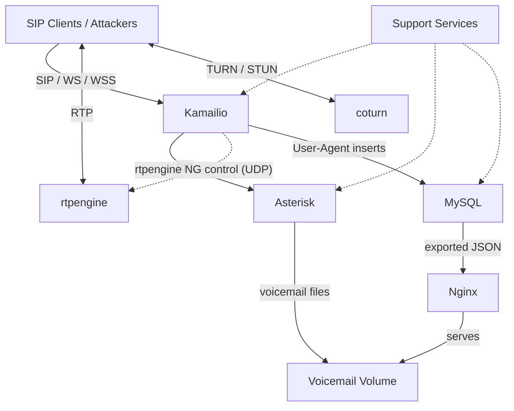
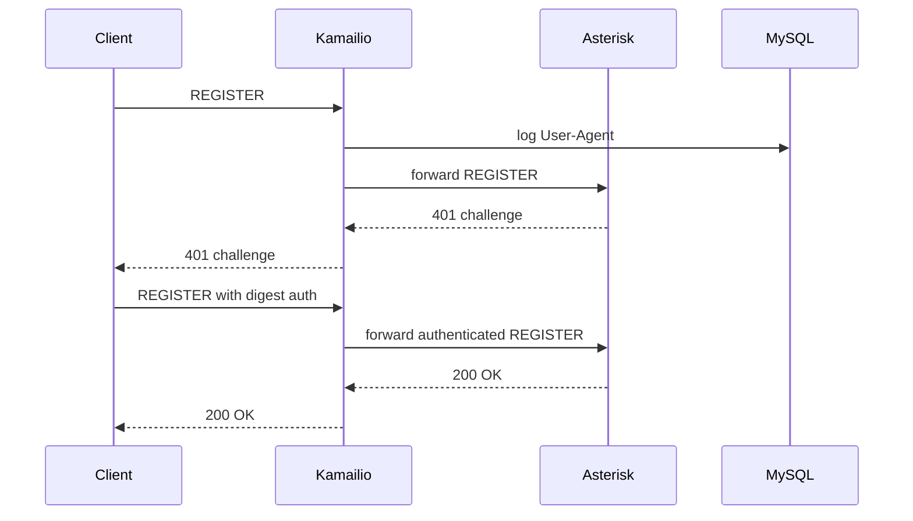
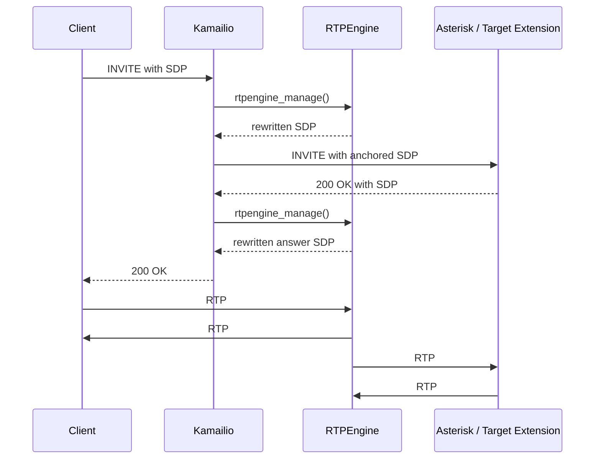

# pbx1 Architecture

This document describes the current `pbx1` scenario as it exists in this repository. It is intentionally focused on the running stack, current support services, and the vulnerabilities that are implemented today.

## Scope

- `pbx1` is one of the two active scenarios in this repository
- the runtime entrypoint is `compose/base.yml` together with `compose/pbx1.yml`
- local rebuilds use `compose/dev.yml` together with `compose/dev.pbx1.yml` and are documented in [../development.md](../development.md)

## Stack At A Glance

| Service | Role | External surface | Key files |
|---------|------|------------------|-----------|
| Kamailio | Public SIP edge, WS/WSS edge, SIP-to-SQL logging path | `5060` UDP/TCP, `5061` TCP, `8000` TCP, `8443` TCP | `build/kamailio/config/kamailio.cfg`, `build/kamailio/config/tls.cfg`, `build/kamailio/run.sh` |
| Asterisk | Back-end PBX, endpoints, voicemail, echo targets | receives forwarded SIP from Kamailio, serves RTP via host networking | `build/asterisk/config/pjsip.conf`, `build/asterisk/config/extensions.conf`, `build/asterisk/config/voicemail.conf`, `build/asterisk/config/rtp.conf` |
| rtpengine | Media proxy between clients and Asterisk | `35000-40000` UDP | `build/rtpengine/run.sh`, `build/rtpengine/healthcheck/healthcheck.sh` |
| coturn | TURN/STUN service | `3478` UDP/TCP, `5349` TCP/TLS | `compose/pbx1.yml` |
| Nginx | HTTP/HTTPS surface, voicemail exposure, browser softphone, user-agent log UI | `80` TCP, `443` TCP | `build/nginx/config/sites-available/default.pbx1`, `build/nginx/web-pbx1/` |
| MySQL | Stores User-Agent logs and seeded fake customer data | `23306` TCP by default via `MYSQL_PORT` | `build/kamailio/run.sh`, `build/mysql/validate-and-start.sh`, `build/mysqlclient/dump-uas.py` |

## Topology

The runtime shape is:

- clients talk SIP to Kamailio
- Kamailio forwards signaling to Asterisk
- Kamailio controls rtpengine for media anchoring
- clients send media to rtpengine, which proxies it to Asterisk
- Kamailio writes `User-Agent` values into MySQL
- Nginx exposes voicemail artifacts and exported User-Agent logs
- coturn provides a separate TURN/STUN attack surface

## Network Model

Most of the scenario uses host networking because the lab depends on:

- SIP over multiple transports
- large RTP UDP ranges
- predictable host-level port exposure for attack exercises

Current networking split:

- host-networked: `kamailio`, `asterisk`, `rtpengine`, `nginx`, `coturn`, `db`, `mysqlclient`, `dbcleaner`, `baresip-callgen*`, `baresip-digestleak`, `testing`
- bridge-networked: `attacker`, `certbot`
- no network: `voicemailcleaner`

This is why Linux is the supported host path and why direct Docker Desktop deployment on macOS or Windows is not supported.

## Core Flows

### Registration And Authentication

Normal SIP registration goes through Kamailio to Asterisk:

Important exception:

- extension `2000` is the digest-leak target
- the `baresip-digestleak` helper keeps `2000` registered
- Kamailio handles that path specially so attackers can repeatedly trigger digest challenges

### Call And Media Flow

Most user-facing PBX calls terminate at Asterisk, but media is anchored by rtpengine. The digest-leak target `2000` is a separate helper-backed path handled specially by Kamailio:

This is the core layout behind the RTP exercises:

- `1300` provides a stable call target for RTP bleed
- `1200` is the echo service used for RTP injection
- `1100` is voicemail and acts as the RTP flood target
- `2000` is the helper-backed digest-leak target handled specially by Kamailio

## Service Roles

### Kamailio

Kamailio is the public signaling edge for `pbx1`.

Current responsibilities:

- accepts SIP over UDP, TCP, TLS, WS, and WSS
- forwards authenticated signaling to Asterisk
- controls rtpengine
- logs client-controlled `User-Agent` values into MySQL
- implements extension-specific lab behavior such as enumeration and digest leak handling

### Asterisk

Asterisk is the back-end PBX.

Current endpoint roles:

| Extension | Purpose |
|-----------|---------|
| `1000` | normal user endpoint with weak password `1500` |
| `1100` | voicemail target and RTP flood target |
| `1200` | echo target |
| `1300` | RTP bleed target kept busy by call generators |

Extension `2000` is not a normal Asterisk user endpoint. The `baresip-digestleak` helper keeps it registered and Kamailio handles that path specially for the digest-leak exercise.

### rtpengine

rtpengine anchors media for calls that traverse Kamailio and Asterisk.

Current repo assumptions:

- media ports come from `35000-40000/UDP`
- RTP from clients is proxied to Asterisk RTP ports `10000-15000/UDP`
- this proxy layer is part of the intended RTP attack surface

### coturn

coturn is separate from the SIP path. It exists to support TURN/STUN exercises and the relay-abuse scenario.

Current repo assumptions:

- long-term credentials are weak by design: `user` / `joshua`
- the CLI password is `coturn`
- the allowed-peer policy is intentionally permissive for the abuse exercise

### Nginx

Nginx provides the web surface for the lab.

Current exposed paths include:

- `/` for the landing page
- `/call/` for the browser softphone
- `/voicemail/` for exposed voicemail artifacts
- `/logs/` for the exported log viewer
- `/logs/useragents/` for exported User-Agent data
- `/secret/` as part of the TURN relay abuse scenario

### MySQL

MySQL is not a SIP subscriber database in this scenario. It exists primarily for the SIP-to-SQL and SIP-to-XSS paths.

Current data roles:

- stores client-controlled `User-Agent` values in the `useragents` database
- contains seeded fake `customers` data used by the SQL injection exercise
- exposes the intentionally weak `kamailio` / `kamailiorw` credential on host port `23306` by default
- schema creation and `customers` seeding happen in `build/kamailio/run.sh`

## Support Services

The lab depends on several helper containers that make the exercises repeatable.

### Call Generators

`baresip-callgen`, `baresip-callgen-b`, and `baresip-callgen-c` keep extension `1300` active.

Current behavior from `compose/pbx1.yml`:

- three staggered callers
- `CALL_DURATION=20`
- `CALL_PAUSE=0`
- start delays `0`, `8`, and `16`

### Digest-Leak Helper

`baresip-digestleak` keeps extension `2000` registered and auto-answers calls so the digest-leak exercise remains reproducible.

### Data Maintenance

- `mysqlclient` exports User-Agent data into the Nginx document root
- `dbcleaner` truncates the `useragents` table periodically
- `voicemailcleaner` limits voicemail growth

### Test Containers

Two tool containers exist behind the `testing` profile:

- `testing`: host-networked local diagnostics, packet capture, and full regression checks
- `attacker`: bridge-networked remote-attacker vantage point

These are part of the architecture because several exercises and checks depend on the distinction between host-local and remote-attacker views.

### Certbot

`certbot` is only relevant when `DOMAIN` and `EMAIL` are set. For normal lab use, self-signed certificates generated by `./scripts/init-selfsigned.sh` are the expected path.

## State And Configuration

### Persistent Volumes

| Volume | Purpose |
|--------|---------|
| `voicemail` | voicemail data exposed through Nginx |
| `acme-challenge` | ACME webroot data for certbot |
| `wwwlog` | exported User-Agent JSON for the web UI |
| `mysqlsock` | MySQL Unix socket sharing |

### Runtime Inputs

The main runtime inputs are:

- `PUBLIC_IPV4` for SIP and RTP advertisement
- optional `PUBLIC_IPV6` for dual-stack exposure
- `MYSQL_ROOT_PASSWORD` generated by `./scripts/generate_passwords.sh`
- `SIPCALLER1_PASSWORD` generated by `./scripts/generate_passwords.sh`
- optional `DOMAIN` and `EMAIL` for Let's Encrypt

Certificates are read from `data/certs/`.

### Image Model

The runtime compose files use published, versioned images. The repo-root `VERSION` file is the release source of truth, and local source rebuilds are opt-in via the dev override files.

Published runtime images expose a standard metadata file at `/usr/share/dvrtc/version.json`, and nginx serves that information at `GET /__version` for quick release checks.

For current local build constraints, including `linux/amd64` and the `testing` profile requirements, see [../development.md](../development.md).

## Deliberately Vulnerable Behavior

This is the current vulnerability map by service:

- Kamailio:
  returns distinguishable SIP responses for valid and invalid extensions, special-cases `2000`, logs raw `User-Agent` values to SQL, and does not enforce active SIP request throttling
- Asterisk:
  keeps weak endpoint credentials and exposes voicemail and media behaviors needed for the RTP exercises
- rtpengine:
  provides the RTP attack surface used for bleed and injection scenarios
- MySQL:
  exposes intentionally weak application credentials and stores attacker-controlled data
- Nginx:
  exposes voicemail browsing and renders exported attacker-controlled data
- coturn:
  uses weak credentials and a permissive relay policy for TURN abuse

See the component reference docs and exercises for the hands-on view of each path.

## Operational Constraints

These are the current architectural constraints that matter when running or modifying the lab:

- host networking is a design requirement, not an implementation accident
- the scenario assumes large open UDP ranges for media
- `testing` and `attacker` are profile-gated and are not always visible in `docker compose ps`
- dual-stack behavior is opt-in through `PUBLIC_IPV6`
- the stack is intentionally unsafe and should only run on isolated hosts

## Related Documentation

- [Overview](overview.md)
- [Kamailio Configuration](kamailio.md)
- [Asterisk Configuration](asterisk.md)
- [RTPEngine Reference](rtpengine.md)
- [coturn Reference](coturn.md)
- [Nginx Reference](nginx.md)
- [MySQL Reference](mysql.md)
- [Support Services](support-services.md)
- [Troubleshooting](../troubleshooting.md)
