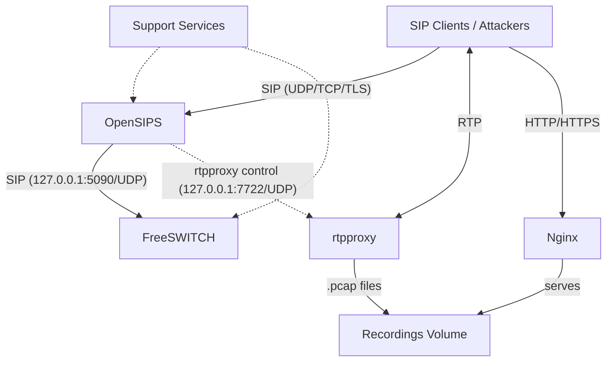
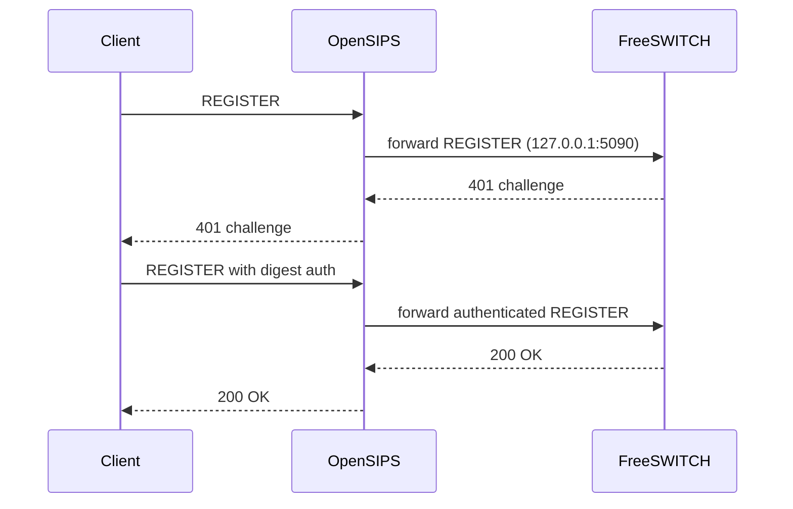
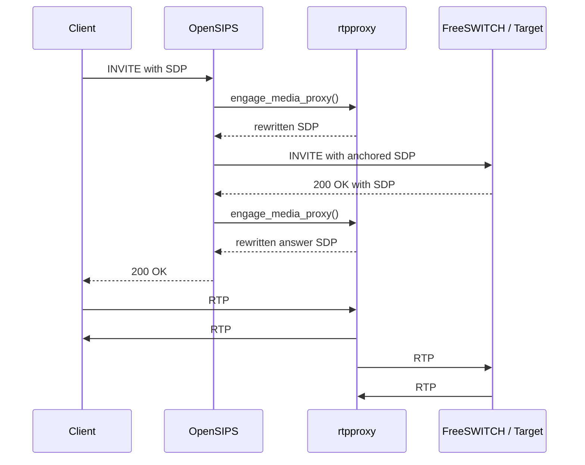
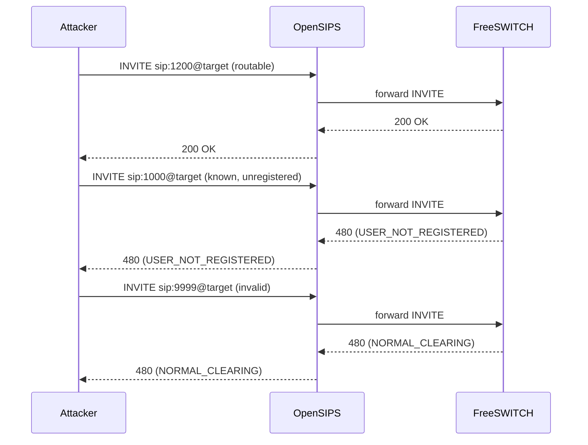

# pbx2 Architecture

This document describes the current `pbx2` scenario as it exists in this repository. It covers the running stack, current support services, and the vulnerabilities that are implemented today.

## Scope

- `pbx2` is one of the two active scenarios in this repository
- the runtime entrypoint is `compose/base.yml` together with `compose/pbx2.yml`
- local rebuilds use `compose/dev.yml` together with `compose/dev.pbx2.yml` and are documented in [../development.md](../development.md)

## Stack At A Glance

| Service | Role | External surface | Key files |
|---------|------|------------------|-----------|
| OpenSIPS | Public SIP edge, INVITE-based enumeration, digest-leak routing | `5060` UDP/TCP, `5061` TCP | `build/opensips/config/opensips.cfg`, `build/opensips/config/tls.cfg`, `build/opensips/run.sh` |
| FreeSWITCH | Back-end PBX, endpoints, echo/call targets, Lua SQLi demo | receives forwarded SIP from OpenSIPS on `127.0.0.1:5090/UDP` | `build/freeswitch/config/directory/default.xml`, `build/freeswitch/config/dialplan/default.xml`, `build/freeswitch/scripts/map_did_to_route.lua` |
| rtpproxy | Media proxy with unconditional recording | `35000-40000` UDP | `build/rtpproxy/run.sh`, `build/rtpproxy/healthcheck/healthcheck.sh` |
| Nginx | HTTP/HTTPS surface, RTP recordings exposure | `80` TCP, `443` TCP | `build/nginx/config/sites-available/default.pbx2`, `build/nginx/web-pbx2/` |

## Topology

The runtime shape is:

- clients talk SIP to OpenSIPS
- OpenSIPS forwards signaling to FreeSWITCH on loopback
- OpenSIPS controls rtpproxy for media anchoring
- clients send media to rtpproxy, which proxies it to FreeSWITCH and records every session
- Nginx exposes the recorded packet captures
- extension `2000` is handled as an OpenSIPS-local registration instead of being forwarded to FreeSWITCH

## Network Model

Most services use host networking because the lab depends on:

- SIP over multiple transports on standard ports
- a large public RTP UDP range
- predictable host-level port exposure for attack exercises

Current networking split:

- host-networked: `opensips`, `freeswitch`, `rtpproxy`, `nginx-pbx2`, `baresip-callgen-pbx2`, `baresip-callgen-b-pbx2`, `baresip-callgen-c-pbx2`, `baresip-digestleak-pbx2`, `testing`
- bridge-networked: `attacker`, `certbot`
- no network: `recordingscleaner`

This is why Linux is the supported host path and why direct Docker Desktop deployment on macOS or Windows is not supported.

## Core Flows

### Registration And Authentication

Normal SIP registration goes through OpenSIPS to FreeSWITCH:

Exception: extension `2000` is handled differently. OpenSIPS accepts its `REGISTER` only from loopback and stores the contact in its own usrloc, bypassing FreeSWITCH. The `baresip-digestleak-pbx2` helper keeps `2000` registered through this path so attackers can repeatedly trigger digest challenges.

### Call And Media Flow

Calls to PBX targets go through OpenSIPS to FreeSWITCH, with media anchored by rtpproxy:

rtpproxy records every anchored session unconditionally. The resulting `.pcap` files are exposed through Nginx at `/recordings/`.

This is the core layout behind the RTP and media exercises:

- `1300` provides a stable call target for RTP bleed (kept busy by call generators)
- `1200` is the echo service used for RTP flood exercises
- `2000` is the helper-backed digest-leak target handled by OpenSIPS-local usrloc

### INVITE-Based Enumeration

Unauthenticated `INVITE` requests are forwarded to FreeSWITCH, which returns different outcomes depending on target state:

The three distinct outcomes allow classification of routable, known-but-unregistered, and invalid extensions.

## Service Roles

### OpenSIPS

OpenSIPS is the public signaling edge for `pbx2`.

Current responsibilities:

- accepts SIP over UDP, TCP, and TLS
- forwards registrations and calls to FreeSWITCH on loopback
- controls rtpproxy for media anchoring
- handles extension `2000` locally for the digest-leak path
- passes through distinct downstream responses that enable INVITE-based enumeration

### FreeSWITCH

FreeSWITCH is the back-end PBX.

Current endpoint and dialplan roles:

| Extension | Type | Purpose |
|-----------|------|---------|
| `1000` | authenticated user | weak password `1500`, online cracking target |
| `sipcaller1` | authenticated user | call-generator account, generated password |
| `1200` | dialplan service | echo target, RTP flood target |
| `1300` | dialplan service | silent answer, kept busy by call generators for RTP bleed |
| `2001` | dialplan service | public HAL-style service, front door to the Lua SQLi demo |
| `9000` | dialplan service | hidden internal-only maintenance service, reachable only through the SQLi-driven DID mapping override |

### rtpproxy

rtpproxy anchors media for calls that traverse OpenSIPS and FreeSWITCH.

Current behavior:

- media ports are `35000-40000/UDP`
- RTP from clients is proxied to FreeSWITCH RTP ports `10000-15000/UDP`
- every anchored session is recorded unconditionally with `.pcap` output
- the public RTP range and permissive source handling are part of the intended attack surface

### Nginx

Nginx provides the web surface for the lab.

Current exposed paths:

- `/` for the scenario landing page
- `/recordings/` for exposed RTP packet captures (fancy directory index)
- `/recordings/spool/` for the active recording spool
- `/__version` for release metadata

## Support Services

### Call Generators

`baresip-callgen-pbx2`, `baresip-callgen-b-pbx2`, and `baresip-callgen-c-pbx2` keep extension `1300` active.

Current behavior from `compose/pbx2.yml`:

- three staggered callers
- `CALL_DURATION=20`
- `CALL_PAUSE=0`
- start delays `0`, `8`, and `16`

### Digest-Leak Helper

`baresip-digestleak-pbx2` keeps extension `2000` registered through the OpenSIPS loopback-only path and auto-answers calls so the digest-leak exercise remains reproducible.

### Recordings Cleaner

`recordingscleaner` limits `.pcap` growth from continuous call generators and RTP flood exercises:

- trims files older than `30m`
- caps per-file size at `1GB`, total directory size at `5GB`
- keeps at most `300` files

### Test Containers

Two tool containers exist behind the `testing` profile in `compose/base.yml`:

- `testing`: host-networked local diagnostics, packet capture, and regression checks
- `attacker`: bridge-networked remote-attacker vantage point

The regression path enables the checks relevant to the `pbx2` attack surfaces, including RTP flood.

### Certbot

`certbot` is only relevant when `DOMAIN` and `EMAIL` are set. For normal lab use, self-signed certificates from `./scripts/init-selfsigned.sh` are the expected path.

## Persistent Volumes

| Volume | Purpose |
|--------|---------|
| `rtp-recordings` | rtpproxy packet captures exposed through Nginx |
| `acme-challenge` | ACME webroot data for certbot |

## Runtime Inputs

The main runtime inputs are:

- `PUBLIC_IPV4` for SIP and RTP advertisement
- optional `PUBLIC_IPV6` for dual-stack exposure
- `SIPCALLER1_PASSWORD` generated by `./scripts/generate_passwords.sh`
- optional `DOMAIN` and `EMAIL` for Let's Encrypt

Certificates are read from `data/certs/`.

## Deliberately Vulnerable Behavior

Current vulnerability map by service:

- OpenSIPS:
  exposes distinct unauthenticated `INVITE` outcomes for routable, known-but-unregistered, and invalid targets; special-cases extension `2000` for the digest-leak call flow; does not enforce active SIP request throttling
- FreeSWITCH:
  keeps weak endpoint credentials on `1000`; exposes the intentionally vulnerable Lua/SQLite SQL injection demo on `2001` that can query the internal route for the hidden `9000` maintenance backdoor; produces distinct downstream call outcomes that enable enumeration through OpenSIPS
- rtpproxy:
  exposes a public RTP range; accepts traffic that enables RTP bleed-style probing; records every anchored session unconditionally; allows recording growth during RTP flooding
- Nginx:
  exposes recorded packet captures with directory browsing enabled
- Support services:
  background call generators keep active media flowing for RTP exercises; the `baresip-digestleak-pbx2` helper keeps extension `2000` registered for the digest-leak path

Intentional boundary: extension `2000` remains anonymously callable for the digest-leak exercise but is not anonymously registerable from the public network. Only the loopback helper path should register it.

## Operational Constraints

- host networking is a design requirement, not an implementation accident
- the scenario assumes a large publicly reachable UDP range for media
- `testing` and `attacker` are profile-gated and are not always visible in `docker compose ps`
- dual-stack behavior is opt-in through `PUBLIC_IPV6`
- the stack is intentionally unsafe and should only run on isolated hosts

## Related Documentation

- [Overview](overview.md)
- [OpenSIPS Configuration](opensips.md)
- [FreeSWITCH Configuration](freeswitch.md)
- [RTPProxy Reference](rtpproxy.md)
- [Nginx Reference](nginx.md)
- [Support Services](support-services.md)
- [Exercise Index](exercises/README.md)
- [Troubleshooting](../troubleshooting.md)
